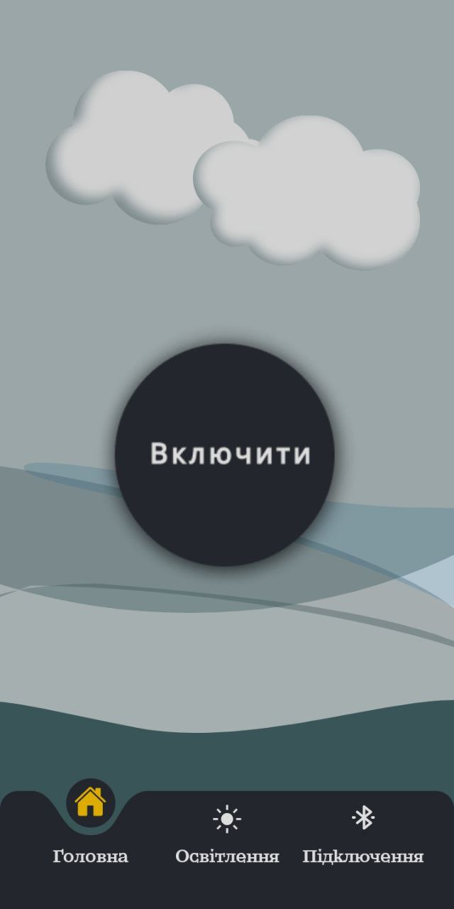
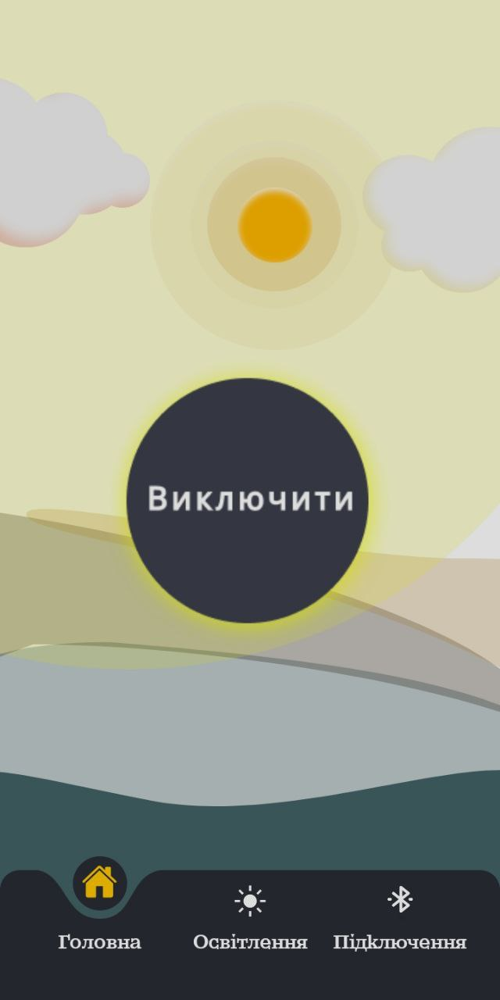
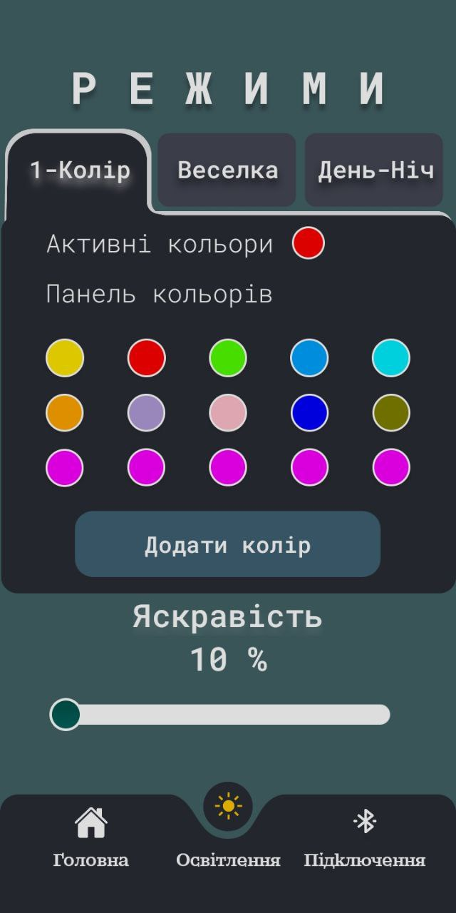
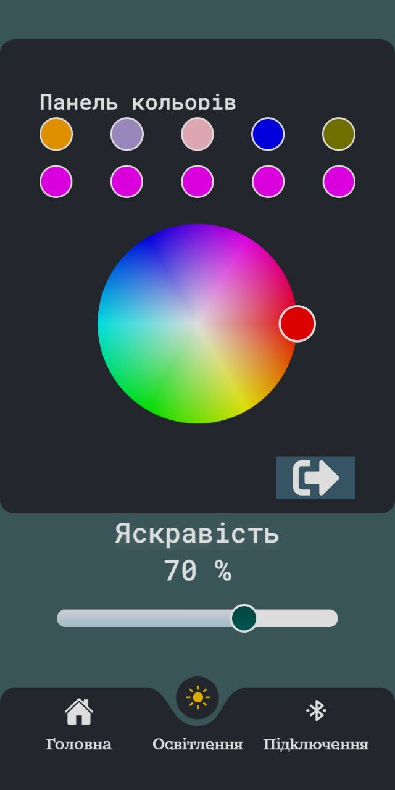
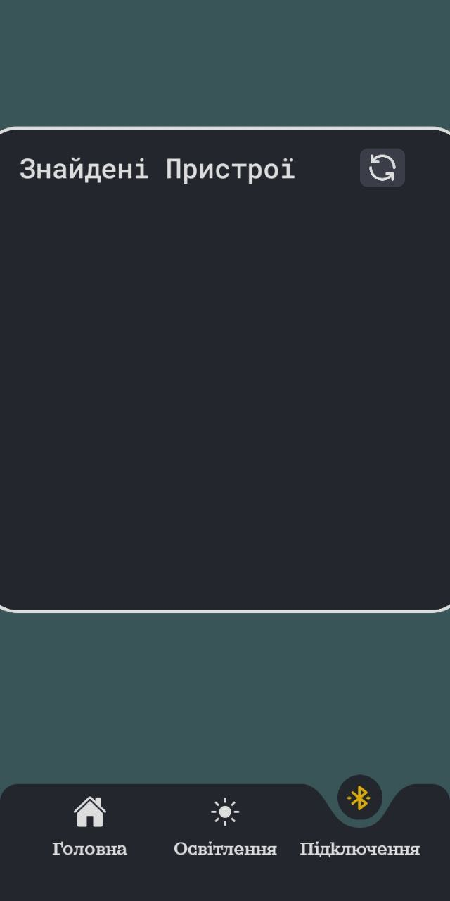
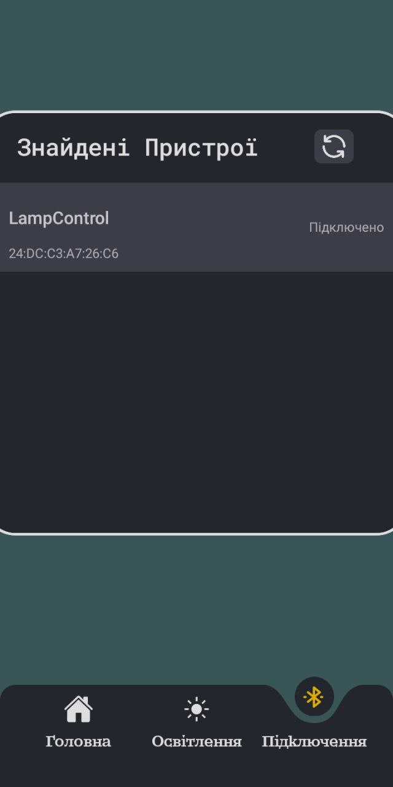

# LampControl Android App

## About

LampControl is an Android application designed to interface with an ESP32 over Bluetooth Low Energy and control an LED lamp. This app works in conjunction with the ESP32 firmware from this repository [LampControl ESP32 Firmware](https://github.com/TraineeBeba/LampControl-ESP32-Firmware).

One of the key features of LampControl is its bidirectional communication capability with the ESP32 controller. This means that any changes made to the ESP32's state through the app are reflected on the LED lamp. Moreover, if the ESP32's state is altered through physical interactions, such as button presses directly on the device, these changes are instantly synchronized and updated in the LampControl app. This synchronization ensures that the app always displays the current state of the lamp, providing a consistent and reliable user experience.

## Installation

To install the app on your Android device:

1. Clone the repository using:
git clone https://github.com/TraineeBeba/LampControl-Android-App.git
2. Open the project in Android Studio.
3. Connect your Android device to your computer and enable USB debugging.
4. Build and run the application on your device from Android Studio.

## Usage

After installation, launch the app and follow the on-screen instructions to connect to your ESP32. You can control the connected devices using the intuitive interface provided by the app.

## App UI

<table>
  <tr>
    <td></td>
    <td></td>
  </tr>
  <tr>
    <td></td>
    <td></td>
  </tr>
  <tr>
    <td></td>
    <td></td>
  </tr>
</table>

